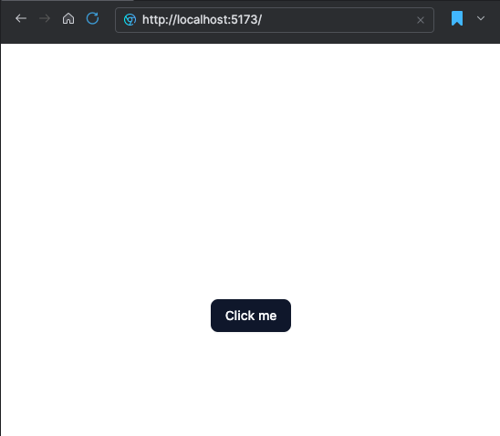

# Vite React Tutorial
This tutorial will guide you through setting up a React application from ground up.
It will cover the following technologies:
- Vite
- React
- TypeScript
- Tailwind CSS
- Shadcn/UI
- TanStack Router
- TanStack Query


## Lesson 1: Setting Up Vite with React and TypeScript
```bash
pnpm create vite@latest vite-shadcn-tan-tutorial --template react-ts
cd vite-shadcn-tan-tutorial
pnpm install
pnpm run dev
```

## Lesson 2: [Adding Shadcn/UI](https://ui.shadcn.com/docs/installation/vite)

```bash
pnpm add tailwindcss @tailwindcss/vite
```
Replace everything in src/index.css with the following:
```css
@import "tailwindcss";
```
Edit tsconfig.json file
```json
{
  "files": [],
  "references": [
    {
      "path": "./tsconfig.app.json"
    },
    {
      "path": "./tsconfig.node.json"
    }
  ],
  "compilerOptions": {
    "baseUrl": ".",
    "paths": {
      "@/*": ["./src/*"]
    }
  }
}
```

Edit tsconfig.app.json file
```json
{
  "compilerOptions": {
    // ...
    "baseUrl": ".",
    "paths": {
      "@/*": [
        "./src/*"
      ]
    }
    // ...
  }
}
```

Update vite.config.ts

```bash
pnpm add -D @types/node
```

Edit vite.config.ts
```typescript
import path from "path"
import tailwindcss from "@tailwindcss/vite"
import react from "@vitejs/plugin-react"
import { defineConfig } from "vite"

// https://vite.dev/config/
export default defineConfig({
  plugins: [react(), tailwindcss()],
  resolve: {
    alias: {
      "@": path.resolve(__dirname, "./src"),
    },
  },
})
```

Edit src/app.tsx
```tsx
import { Button } from "@/components/ui/button"

function App() {
  return (
    <div className="flex min-h-svh flex-col items-center justify-center">
      <Button>Click me</Button>
    </div>
  )
}

export default App
```
Run the development server
```bash
pnpm run dev
```
You should see a button styled with Shadcn/UI.

